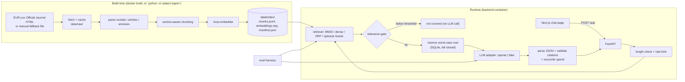

# Design — Ask the EU AI Act

This design implements `requirements.md` (R1–R7) under `.kiro/steering/rules.md`:
Python 3.12 + FastAPI + pytest, Next.js + TypeScript, config from env vars,
small readable code, every module tested, no metrics claimed that were not run.

Non-obvious choices are explained inline; the main alternatives are compared in
[§5 Trade-offs](#5-trade-offs-considered).

---

## 1. Architecture



**Key properties**
- The index is built once, at image build time, from the pinned source. The running demo does no EUR-Lex fetch and no model download (R6.2).
- The backend is stateless per request. "Chat" means a list of independent Q&A turns in the browser; there is no conversation memory (keeps retrieval and citations unambiguous).
- Retrieval and the relevance gate are free. Only the LLM call costs money, so everything that can refuse a request does so before the LLM.

### Repository layout

```
.kiro/{steering,specs}/             rules + this spec
backend/
  askact/
    config.py                       Settings (pydantic-settings), the only place env vars are read
    models.py                       Section id, Chunk, ScoredChunk, API schemas
    ingest/{fetch,parse,chunk,build}.py     `python -m askact.ingest`
    index.py                        write/load artifacts, build hash, staleness check
    embedders.py  rerankers.py      real (sentence-transformers) + deterministic stubs
    retrieval.py                    BM25, dense, RRF, rerank, relevance score
    generation/{llm,prompt,answer}.py       adapters, prompt, gate + parse + validate
    guards/{ratelimit,spend}.py
    api.py                          FastAPI app
    request_log.py                  one privacy-preserving log line per /ask (§3.4)
    evaluation/{schema,metrics,cache,run}.py
  tests/  (mirrors the package) + tests/fixtures/
  Dockerfile  pyproject.toml
frontend/                           Next.js (App Router) + TypeScript, vitest tests
eval/questions.yaml                 written by the project owner
eval/results.md                     written by the harness; pasted into the README
data/{raw,index}/                   generated, gitignored
docker-compose.yml  .env.example  .dockerignore  .github/workflows/ci.yml  README.md
```

Python dependencies: `fastapi`, `uvicorn`, `pydantic-settings`, `httpx`, `beautifulsoup4`, `lxml`, `rank-bm25`, `numpy`, `pyyaml`.
Optional extra `models` = `sentence-transformers` (pulls torch). CI installs only base + `dev`, which is possible because tests use stubs (R6.4).

---

## 2. Data model and index artifacts

**Section id** — `<kind>:<number>`: `article:5`, `recital:12`, `annex:III` (kind is lowercase; annex numbers are upper-case Roman numerals). This is what the LLM cites, what the UI shows, and what `expected_ids` contain.

**Chunk** (one line of `chunks.jsonl`):

| field | example | note |
|---|---|---|
| `chunk_id` | `article:5#2` | section id + 1-based ordinal; stable for a fixed source and chunking params |
| `section_id` | `article:5` | the parent section (used for hits and citations) |
| `kind`, `number` | `article`, `5` | |
| `title` | `Prohibited AI practices` | articles and annexes; `null` for recitals |
| `text` | | body text only, as displayed in the sources panel |

For BM25 and embeddings the indexed string is `"Article 5 — Prohibited AI practices\n" + text` (header prefix). The header is not stored in `text`, so display stays clean.

**Artifacts in `data/index/`**
- `chunks.jsonl`, `embeddings.npy` (float32, L2-normalised, row i ↔ line i), `manifest.json`.
- `manifest.json` records: the pinned source (regulation, CELEX `32024R1689`, OJ reference, URL, retrieval date, `sha256` of the source file), counts (recitals/articles/annexes/chunks), chunking params, `embedding_model`, `schema_version`, and `build_hash`.
- `build_hash = sha256(source_sha256 + canonical_json(chunking_params) + embedding_model)` — exactly the definition in R2.6.
- The BM25 index is rebuilt in memory at startup from `chunks.jsonl` (a small corpus: 495 chunks at the default chunk size, measured in Task 5; no pickle to go stale, no extra artifact to hash).

**Staleness checks**
- `ingest` skips re-embedding when the stored `build_hash` equals the freshly computed one (R2.6).
- The API recomputes the hash at startup from `manifest.source_sha256` + current env params and refuses to serve with a clear "index missing or stale, run ingestion" error on mismatch (R2.8). It needs no raw file at runtime.

---

## 3. Components

### 3.1 Ingestion (R1)

`python -m askact.ingest [--force] [--source-file PATH]`

1. **Fetch** — if `data/raw/ai-act-oj-2024-1689.html` exists and `--force` is not set, reuse it. Otherwise GET `SOURCE_URL` with `httpx`, a descriptive `User-Agent`, and a timeout. The default is the Publications Office resource URL `https://publications.europa.eu/resource/celex/32024R1689`, requested with `Accept: application/xhtml+xml` and `Accept-Language: eng` (the document variant is chosen by content negotiation). The `eur-lex.europa.eu/legal-content/…` HTML page that this design first assumed answers the project's honest User-Agent with a `202 Accepted` bot-challenge page (observed in Task 3), and the project does not impersonate a browser to get around that. A response only counts as the document if the status is exactly 200 and the body contains the Official Journal id `L_202401689EN`; a cached file that fails the same check is ignored and fetched again. EUR-Lex states that the authentic Official Journal is the signed PDF and that the HTML rendition is for information only, so the README limitations say that this app parses the HTML rendition.
2. **Fallback** — if the fetch fails, or the response does not pass validation, load the manually downloaded file: `--source-file` if given, otherwise `SOURCE_FALLBACK_PATH`, which defaults to `data/raw/ai-act-oj-2024-1689.manual.html` (a different name from the cache file so a fetch never overwrites it). This makes the build work offline and is the escape hatch if the source starts challenging automated clients (as `eur-lex.europa.eu` already does). If neither works: print the error, exit non-zero, and write nothing (R1.13).
3. **Pin check** — the document `<title>` must start with `L_202401689EN` (the Official Journal file id, as opposed to a consolidated `02024R1689-…` document), and parsed counts must equal `EXPECTED_COUNTS` (see below). Any mismatch aborts the build. This keeps the "original text of 12 July 2024" claim in R1.2 and R4.6 honest.
4. **Parse** (BeautifulSoup with lxml's **XML** builder: the file is XHTML, and with that builder `class` is one string, not a list). Confirmed against the real file in Task 4:

   | kind | marker | text source |
   |---|---|---|
   | recital | `div.eli-subdivision#rct_N` | its single table row: the `(N)` label cell is checked against the id and dropped, the content cell is the text |
   | article | `div.eli-subdivision#art_N` | number from `p.oj-ti-art` ("Article 5", checked against the id), title from `div.eli-title p.oj-sti-art`, body = every other child |
   | annex | `div.eli-container#anx_III` | number/title from the first two `p.oj-doc-ti` ("ANNEX III", checked against the id; title), body = every other child |

   Sections are matched by a **full** match on the id: the title divs (`art_1.tit_1`) would also match a substring search.
   - **Lists of points** (`(a) …`, `1.`, `(i)`) are tables, nested up to two deep in articles. Each `<tr>` becomes one line `"(a) text"`; a cell holding a sub-list continues on the following lines, in order. Annex rows can have an empty spacer cell; what is left must be exactly a label and its content.
   - **Blocks.** A section's text is a tuple of blocks, one per top-level unit (a numbered paragraph with its sub-points, one definition in Article 3, an annex heading). The chunker packs whole blocks (§3.1 step 5).
   - **Footnote references** (`<a><span class="oj-note-tag">`) are dropped together with the space before them; the footnote texts are outside the sections. **Superscripts are exponents** and are written with `^` (Article 51's `10^25`); plain text extraction would produce `1025`. The `(*)` note marker inside an `a.oj-quotation` link is kept as text.
   - Odd constructs that occur in the document and are handled: a bare `;` after a quoted paragraph (joins the previous line); annex VI's numbers and text set as two `display:inline` paragraphs (one line); links (text kept, URL dropped); non-breaking spaces (4,160 of them) become ordinary spaces.
   - **Strict by design.** Markup the parser has not seen raises `ParseError` naming the section, instead of being skipped: a skipped element would silently delete part of the law from the index, and the section counts would not notice. Titles and text are kept exactly as published, including the stray backtick in Article 1's title ("Subject matter`").
   - Chapter/section headings between articles are ignored (not required metadata).
   - **Counts.** Task 4's run on the real file found **180** recitals, **113** articles and **13** annexes, numbered without gaps. `EXPECTED_COUNTS` is set from that only once the project owner confirms the numbers; until then `verify()` refuses to run.
   - **Fidelity check.** A test compares, for every section of the real file, the parser's text with an independent plain-text read of the raw element (footnote references removed, exponents marked), ignoring only whitespace. It shares no code with the parser, so it catches a dropped or doubled paragraph that a count never would.
5. **Chunk** (`CHUNK_MAX_CHARS`, default 1800 ≈ 450 tokens at roughly four characters per token, intended to fit the embedder's 512-token window; the character limit is only a proxy and is verified, not assumed — see the token-length test below):
   - One algorithm for every kind of section. A section's *blocks* (numbered paragraphs with their sub-points, one definition, an annex heading) are packed greedily, whole, into chunks up to the limit. A block too big for a chunk on its own is split at **line** boundaries (sub-points stay whole), then **sentence** boundaries (after `.` `;` `:` `?` `!`), then **word** boundaries, and finally fixed cuts for a single over-long word, so the size bound holds for any input. No overlap: blocks are self-contained units, and overlap would duplicate text across citations.
   - **Recitals are not all short.** The first design assumed one chunk per recital; the real text has 35 of 180 recitals over the 1800-character default (the longest is 4,443 characters, roughly 1,100 tokens, which the embedder would silently truncate). A recital is a single block, so those are split at sentence boundaries by the same algorithm; a recital that fits stays whole.
   - **The limit applies to the embedded string**, header and newline included (`Chunk.embed_text`), because that is what the model reads. Headers run from 9 to 215 characters (Annex XII's title is long), so a fixed limit on the text alone would let some chunks overflow. If a limit leaves under 100 characters for text after the header, chunking fails with an error naming the section instead of producing degenerate chunks. A section with no text is also an error: skipping it would silently remove an article from the index.
   - **Measured on the real Act at 1800:** 495 chunks (218 recital, 241 article, 36 annex), longest 1800 characters, none over; 35 recitals, 63 articles and 7 annexes needed splitting; 35 lines needed sentence-level splitting and none needed word-level splitting; text is lossless for all 306 sections.
   - Every chunk keeps the section's number and title (R1.9).
   - **Token-length check.** A `slow`-marked test tokenizes every chunk of the real source, as the exact string that gets embedded (header + text) and with the tokenizer's special tokens included, using the real embedder's tokenizer. It asserts that no chunk exceeds the embedder's max sequence length (read from the loaded model, not hard-coded), and it fails listing the offending chunk ids. If it fails, lower `CHUNK_MAX_CHARS` (or fix the sentence splitter) and rebuild. It needs the real model and the real source file, so it runs locally and is skipped when either is absent. **Result (Task 5, `BAAI/bge-small-en-v1.5`, limit 512 read from the model):** at 1800 characters all 495 chunks fit; the longest is 499 tokens (`annex:I#4`, a list of directive numbers and citations), the median 235. The margin on that one chunk is 13 tokens, because characters per token ranges from about 2.9 in such lists to over 5 in prose, which is why the character limit is a proxy and this test exists. The same check fails as intended when the limit is raised: at 2600 characters nine chunks exceed 512 tokens. Whether smaller chunks retrieve better is a question for the evaluation, not for this check.
6. **Embed and write** — embed the header-prefixed chunk strings with the configured local model, write the artifacts atomically (temp dir then rename, so a failure never leaves a partial index), and print counts of recitals/articles/annexes/chunks (R1.10).

**Fixture:** `tests/fixtures/mini_act.html` is a trimmed file with the same markup: 3 recitals, 2 articles (one long enough to be split), 1 annex. Tests assert its counts (R1.11). The full-source count test runs only if `data/raw/ai-act-oj-2024-1689.html` exists, otherwise `pytest.skip("full source not present")` (R1.12).

### 3.2 Retrieval (R2)

```python
class Retriever:
    def search(self, query: str, config: Config, k: int) -> RetrievalResult
# Config = "bm25" | "dense" | "hybrid" | "hybrid+rerank"
# RetrievalResult = chunks: list[ScoredChunk], relevance: float, relevance_kind: "cosine" | "rerank"
```

- **bm25**: `rank_bm25.BM25Okapi` over lowercase word tokens of the header-prefixed text (no stemming; simple and predictable for legal terms).
- **dense**: embed the query, then score `embeddings @ q` (cosine, since both are normalised). For the BGE v1.5 models the query gets the retrieval instruction `Represent this sentence for searching relevant passages: ` (the string is from the model card, which also says documents never get it). The model card calls the instruction *optional* for v1.5 (omitting it costs only "a slight degradation") but recommends it for short queries against long passages, which is this app; it also says to choose by performance on your own task. So it is on by default, and whether it helps here is a question for the retrieval evaluation. It is applied only to models whose card was checked: any other `EMBEDDING_MODEL` is embedded without an instruction and a warning is logged, rather than being given the wrong one. The model ships no prompt of its own (its `config_sentence_transformers.json` has none), so the string lives in `embedders.py`.
- **hybrid**: take the top `CANDIDATES` (default 30) from each ranker and fuse with **Reciprocal Rank Fusion**, `score = Σ 1/(60 + rank)`. RRF uses ranks only, so BM25 and cosine scores never need to be put on one scale (R2.3).
- **hybrid+rerank**: rerank the top `RERANK_CANDIDATES` (default 20) fused candidates with a cross-encoder and return the top k. With `RERANKER_ENABLED=false` the reranker is never loaded or called (R2.4). The app's config is `hybrid+rerank` if the flag is on, else `hybrid`; the eval harness iterates all four.
- **Relevance score** (R3.7/R3.8), attached to every result:
  - `hybrid+rerank` → the reranker score of the rank-1 chunk (`relevance_kind="rerank"`).
  - every other config → `cosine(query, rank-1 chunk)`, computed for all of them including `bm25` and `hybrid` (`relevance_kind="cosine"`). So `bm25` still loads the embedder at query time; that is the price of one comparable gate across configs.
- **Models** (env-configurable, defaults are my picks and unverified until the eval runs): embedder `BAAI/bge-small-en-v1.5` (small, CPU-friendly, 512-token window); reranker `cross-encoder/ms-marco-MiniLM-L-6-v2` (small and fast on CPU). Both are loaded through `sentence-transformers`.
- **Stubs (CI, R6.4):**
  - `HashEmbedder`: lower-cased word tokens hashed into 256 buckets with `hashlib.blake2b` (not `hash()`, which Python randomises per process), counted and L2-normalised. Deterministic across processes, no download, never imports torch, and cosine grows with the words two texts share (and with repetition), so tests can assert sensible ordering. Text with no word characters has no direction and maps to the zero vector. Its `name` includes its dimension, because the name goes into the index build hash.
  - The real `SentenceTransformerEmbedder` runs on the CPU, returns float32 unit vectors, and reads its dimension from the model (384 for the default). Both embedders implement `embed_documents(texts)` and `embed_query(text)`; documents never get the query instruction.
  - `OverlapReranker`: score = Jaccard overlap of query/passage tokens.
  - Selected by `EMBEDDER=stub|real` and `RERANKER=stub|real` (default `real`; tests and CI set `stub`).

### 3.3 Generation (R3)

`answer(question, retrieval_result, settings, llm, ledger) -> AnswerResult`, in this order:

1. **Relevance gate.** Pick the threshold for the result's kind: `RELEVANCE_THRESHOLD_COSINE` or `RELEVANCE_THRESHOLD_RERANK`. If `relevance < threshold`, return `not_covered` and make no LLM call and no spend reservation (R3.7).
2. **Prompt.** The system prompt states the rules: use only the passages; if they do not contain the answer set `covered=false`; cite only the section ids shown; reply with a single JSON object `{"answer": str, "citations": [str], "covered": bool}` and nothing else. Passages are labelled by *section id*: `[article:5] Article 5 — Prohibited AI practices\n<text>`, so the model cites sections, not chunk ids.
3. **Call** through the provider adapter with `max_output_tokens = MAX_OUTPUT_TOKENS` (R6.12), after the spend reservation (§3.4).
4. **Parse** the reply as JSON (tolerating a leading/trailing code fence) into a pydantic model. On failure return `llm_bad_output`; the raw text is never shown as an answer (R3.3).
5. **Validate citations** — normalise each cited id and keep only those whose section is in the retrieved set; the rest are dropped (R3.5). Decision: if `covered=true` but no valid citation remains, the answer is withheld and the result is `not_covered`, because an uncited answer breaks the grounding promise.
6. `covered=false` → `not_covered` (R3.6).
7. **Sources** returned = the retrieved chunks whose section is cited, with section id, label ("Article 5"), title, text, and score (R3.11).

**Provider adapters** (`generation/llm.py`): one tiny interface, `complete(system, user, max_output_tokens) -> LLMReply(text, input_tokens | None, output_tokens | None)`, with two implementations selected by `LLM_PROVIDER`:
- `openai`: Chat Completions over `httpx`; `LLM_BASE_URL` can point to any OpenAI-compatible server.
- `fake`: scripted replies for tests/CI; counts its calls.

OpenAI is the only real provider (the project owner's choice). The interface is what makes the provider configurable (R3.9): another provider is a new class plus one line in the `get_llm` factory, and none is built until needed.

A missing or invalid key/provider/model becomes a clear `llm_unavailable` error (R3.10).

**Verifying the adapters.** Request and response shapes are not written from memory: when the OpenAI adapter is implemented, the task reads OpenAI's current API documentation first (endpoint, auth header, version header if any, the output-token parameter name, and where token usage is reported) and records the doc URL and the date it was read in a comment at the top of the adapter. The adapter also gets one live smoke test, marked `slow` and manual: it makes a single tiny real call (a trivial prompt, a very small output-token limit) and asserts a non-empty reply and that token usage is reported. It reads its key from the environment and is skipped when the key is absent, so it never runs in CI and never needs a secret there. The smoke test calls the adapter directly, so it does not pass through the spend ledger; its cost is a handful of tokens per run.

### 3.4 API and safety guards (R6)

**Endpoints:** `POST /ask {question}` and `GET /health`.

```json
{ "status": "answered | not_covered",
  "answer": "…",
  "citations": ["article:5"],
  "sources": [{"section_id":"article:5","label":"Article 5","title":"…","text":"…","score":0.71}] }
```

Errors use `{"error": {"code": "...", "message": "..."}}`:

| code | HTTP | when |
|---|---|---|
| `question_too_long` | 422 | longer than `MAX_QUESTION_CHARS` (R6.11) |
| `rate_limited` | 429 | over the per-client limit; `Retry-After` set (R6.5) |
| `spend_cap_reached` | 503 | reservation would exceed the cap, or the ledger/price table is unusable (R6.8–R6.9) |
| `llm_unavailable` | 503 | provider, model, or key missing/invalid |
| `llm_bad_output` | 502 | reply is not the required structure |
| `index_unavailable` | 503 | index missing or stale |

**Order of checks in `/ask`:** length → rate limit → retrieve → relevance gate → spend reservation → LLM → validate → reconcile. Everything cheap and free runs before anything that costs money.

**Rate limiting** (`guards/ratelimit.py`, ~30 lines, in-process): sliding window of timestamps per client key, `RATE_LIMIT_PER_MINUTE`; empty windows are pruned so memory stays bounded. The client key is the socket peer address, or, if `TRUSTED_PROXY_HEADER` is set (e.g. `X-Forwarded-For`), the **last** comma-separated entry of that header — the one appended by our own proxy; earlier entries are client-supplied and spoofable. This assumes exactly one trusted proxy hop and is documented in `.env.example`. State is per process, so the backend runs a single uvicorn worker; the README lists this as a limitation.

**Spend ledger** (`guards/spend.py`, SQLite at `SPEND_DB_PATH` on a named Docker volume so it survives container re-creation, R6.10):
- Table `spend(day TEXT PRIMARY KEY, micro_usd INTEGER)`; the day is the UTC date, so "reset daily" is simply a new row. Money is stored as integer micro-dollars. Since a price of $X per million tokens is exactly X µ$ per token, `cost_µ$ = tokens × price_per_Mtok`, rounded up.
- **Reserve** (R6.7): `BEGIN IMMEDIATE`; read today's total; if `total + reservation > cap` roll back and refuse (R6.8); otherwise add the reservation and commit. `reservation = (estimated_input_tokens + MAX_OUTPUT_TOKENS) × price`, with `estimated_input_tokens = ceil(len(system + user) / 3)`. English averages roughly four characters per token, so this deliberately over-estimates; the over-reservation is returned at reconcile.
- **Reconcile** (R6.7): after the call, in one transaction on the *reservation's* day (a call can straddle midnight), replace the reservation with the actual cost from reported tokens. If usage is not reported, or the process dies before reconciling, the reservation stands as the charge (R6.9).
- **Fail closed** (R6.8–R6.9): an unreadable/unwritable database, a model absent from `LLM_PRICE_TABLE`, or a parse error in the table all refuse the call with `spend_cap_reached`.
- The cap and price table are env config: `DAILY_SPEND_CAP_USD`, `LLM_PRICE_TABLE` (JSON `{"<model>": {"input_per_mtok": x, "output_per_mtok": y}}`). Prices are the operator's responsibility; the repo contains only placeholders.

**Logging** (`request_log.py`; not covered by a requirement, added from design review for privacy). `/ask` emits exactly one structured log line per request containing: timestamp, outcome (`answered`, `not_covered`, or the error code), retrieval config, total latency in ms, and — when an LLM call was made — input and output token counts (or `null` if the provider did not report them). It does **not** log the question text, the answer, the retrieved passages, or the client address. Specifics:
- uvicorn runs with `--no-access-log`, because its default access log records the client IP and path; the single line above replaces it.
- Exception handlers log the error code and exception type, never the request body or the provider's request/response bodies.
- The rate limiter keeps client keys in memory only and never logs them.
- `LOG_QUESTIONS` (default `false`) is the one opt-in for local debugging: when `true`, the question text is added to the line. It is documented in `.env.example` with a warning not to enable it on the public demo.

### 3.5 UI (R4)

Next.js App Router + TypeScript, one page (`app/page.tsx`), a small `lib/api.ts`, plain CSS, no UI library.

- Layout: persistent header notices; a question box; a list of Q&A turns; a sources panel beside (or below, on narrow screens) the **latest** answer.
- States: idle, loading (spinner + submit disabled, so no duplicate submission, R4.4), answered, not covered (distinct styling), error (shows the server's `message`) (R4.5).
- Always-visible notices (R4.6): "Not legal advice." and "Answers are based on the original Official Journal text of 12 July 2024 and do not reflect later amendments, including Regulation (EU) 2026/1744."
- The browser calls the backend directly at `NEXT_PUBLIC_API_URL` (default `http://localhost:8000`); the backend allows `CORS_ORIGINS`. Going direct, rather than through a Next.js rewrite proxy, means the backend sees the real client address for rate limiting instead of the UI container's.
- **`NEXT_PUBLIC_API_URL` is a build-time value.** Next.js inlines `NEXT_PUBLIC_*` variables into the client bundle when the UI is built, so changing it at container start has no effect; it must be passed as a build argument (see the compose file). For a deployment it must be set to the public URL of the backend (for example `https://api.example.org`), the UI image rebuilt, and the UI's public origin added to the backend's `CORS_ORIGINS`. The default `http://localhost:8000` only works for local `docker compose up`. `.env.example` and the README state this explicitly.
- **Plain text only.** Answer text, source text and server error messages are rendered as React text nodes, never as HTML or Markdown, and `dangerouslySetInnerHTML` is not used. The text comes from an LLM and from retrieved passages, so it is treated as untrusted.
- Tests: vitest + Testing Library with `fetch` mocked, covering each state, the disabled button, the sources panel, both notices, literal rendering of HTML-looking text in answers/sources/errors, and a source scan that fails on `dangerouslySetInnerHTML`.

### 3.6 Evaluation (R5)

`python -m askact.evaluation.run --k 5 --split dev|test|both [--configs …] [--no-generation]`

**Schema** (`eval/questions.yaml`, validated with pydantic; errors name the entry id, nothing is scored on failure, R5.4):

```yaml
- id: q001
  question: "…"
  split: dev            # dev | test (required)
  category: direct      # direct | paraphrase | multi | out_of_scope
  expected_ids: ["article:5"]   # section ids, all relevant; [] exactly when out_of_scope
```

Extra checks: unique ids; section-id syntax. The harness does not cross-check ids against the index.

**Metrics**, per retrieval config, per split (`k` is chunks; reported in the table header):
- **hit@k** (in-scope only): 1 if any of the top-k chunks has `section_id ∈ expected_ids`, averaged.
- **MRR** (in-scope only): `1/rank` of the first such chunk within the top-k, else 0, averaged. Ranks count chunks, so several chunks of one section occupy several ranks; we do not de-duplicate, to keep the metric the plain definition.
- **Refusal accuracy** (`out_of_scope` only): refused = the gate fires, or the LLM says `covered=false`, or all citations are dropped.
- **Citation precision / recall** (in-scope, R5.8): from the final validated citations; precision = share of cited ids in `expected_ids`; recall = share of `expected_ids` that are cited; an answer with no citations scores 0 on both. These run the full pipeline (retrieve → gate → LLM) for each config.
- `--no-generation` skips the LLM entirely and reports only hit@k and MRR. This is the free path used while tuning retrieval.

**LLM cache and budget** (R5.9): the eval uses the same `answer()` pipeline with a caching wrapper around the LLM adapter. Cache key = `sha256(provider, model, system, user, max_output_tokens)`; because `user` contains the question and the passages, a change to either, or to the model, is a miss. It is stored as JSON lines in `eval/.cache/` (gitignored). `EVAL_MAX_LLM_CALLS` counts only uncached calls; before call number cap+1 the run aborts with a message and prints no generation metrics. The cache persists, so re-running continues where it stopped. The eval is bounded by this cap rather than by the demo's spend ledger; it is an operator-run tool, not the public endpoint.

**Dev/test discipline** (R5.10–R5.11): thresholds are chosen on `dev` only. To support that, the report also prints, per config, the range of the relevance score for in-scope vs `out_of_scope` questions on each split. The default is `--split dev`; `test` is run when finalising, and its table is labelled FINAL. This is a convention the tool encourages, not something it can enforce.

**Output:** a Markdown table plus a metadata block (date, `k`, thresholds, models, index `build_hash`, question counts per split) is printed and written to `eval/results.md`. The README table is pasted from that file, never typed by hand (R5.12, R7.2). The optional manual faithfulness review (R7.5) is done by the owner outside the harness; the README states N and the count judged faithful.

### 3.7 Delivery (R6)

**docker-compose.yml**
```yaml
services:
  backend:
    build: { context: ., dockerfile: backend/Dockerfile }
    env_file: .env
    ports: ["8000:8000"]
    volumes: ["state:/var/lib/askact"]          # SPEND_DB_PATH lives here
    healthcheck: GET /health
  ui:
    build: { context: ./frontend, args: { NEXT_PUBLIC_API_URL: http://localhost:8000 } }
    ports: ["3000:3000"]
    depends_on: { backend: { condition: service_healthy } }
volumes: { state: {} }
```

**Backend image (multi-step, R6.2):** install with the `models` extra (CPU-only torch wheel); `COPY` the source and, if present, `data/raw/` (the manual fallback file); `RUN python -m askact.ingest` (fetches or uses the fallback, downloads the embedding model, builds the index); `RUN` a one-liner that downloads the reranker model; then set `HF_HUB_OFFLINE=1`. The container therefore needs the network only at build time, and a runtime attempt to download anything fails loudly. `.env` is never copied into the image (`.dockerignore`), and the build needs no secrets. The UI image takes `NEXT_PUBLIC_API_URL` as a build argument (§3.5), so it is fixed at build time. The backend image size and its idle memory use are measured (not estimated) once the image builds and are reported in the README with the method and settings used; the models make both non-trivial.

**CI (`.github/workflows/ci.yml`)** — two jobs, no secrets:
- `backend`: Python 3.12, `pip install -e ".[dev]"` (no torch), `pytest -m "not slow"` with `EMBEDDER=stub RERANKER=stub LLM_PROVIDER=fake` (R6.4). Package installation uses the registries; the *tests* make no network calls.
- `frontend`: Node LTS, `npm ci`, `vitest run`, `next build` (type-checks).
- `slow`-marked tests run locally only: `pytest -m slow`. They cover the real embedder/reranker over the fixture, the chunk token-length check over the real source (§3.1), and one live smoke test per LLM adapter (§3.3, which also needs that provider's key in the environment).

---

## 4. Configuration (all via env; documented in `.env.example`, R6.13)

| variable | default | purpose |
|---|---|---|
| `SOURCE_URL` | `https://publications.europa.eu/resource/celex/32024R1689` (§3.1) | where ingestion fetches |
| `SOURCE_FALLBACK_PATH` | `data/raw/ai-act-oj-2024-1689.manual.html` | manually downloaded copy, used if the fetch fails |
| `CHUNK_MAX_CHARS` | 1800 | chunk size bound |
| `EMBEDDING_MODEL` / `RERANKER_MODEL` | see §3.2 | local models |
| `EMBEDDER` / `RERANKER` | `real` | `stub` for tests/CI |
| `RERANKER_ENABLED` | `false` | app uses `hybrid+rerank` when true |
| `TOP_K` | 5 | chunks passed to the LLM |
| `RELEVANCE_THRESHOLD_COSINE` | placeholder until dev tuning | gate for bm25/dense/hybrid |
| `RELEVANCE_THRESHOLD_RERANK` | placeholder until dev tuning | gate for hybrid+rerank |
| `LLM_PROVIDER` | none (required) | `openai` \| `fake` |
| `LLM_MODEL`, `LLM_API_KEY`, `LLM_BASE_URL` | none | provider settings (base URL optional) |
| `LLM_PRICE_TABLE` | none (required for paid use) | per-model prices (JSON) |
| `MAX_OUTPUT_TOKENS` | 500 | LLM output cap |
| `MAX_QUESTION_CHARS` | 500 | input cap |
| `RATE_LIMIT_PER_MINUTE` | 10 | per client key |
| `TRUSTED_PROXY_HEADER` | unset | e.g. `X-Forwarded-For` |
| `DAILY_SPEND_CAP_USD` | 1.00 | cap; fails closed |
| `SPEND_DB_PATH` | `/var/lib/askact/spend.sqlite3` | SQLite on the volume |
| `CORS_ORIGINS` | `http://localhost:3000` | allowed UI origins |
| `EVAL_MAX_LLM_CALLS` | 250 | uncached calls per eval run |
| `LOG_QUESTIONS` | `false` | when `true`, add the question text to the request log line; local debugging only |
| `NEXT_PUBLIC_API_URL` | `http://localhost:8000` | **build-time** UI build arg; must be the public backend URL for a deployment, and changing it needs a UI rebuild (§3.5) |

The numeric defaults (500 tokens, 500 characters, 10/min, $1.00, 250 calls, and the 1800-character chunk size until its token-length test has passed) are starting points. The two relevance thresholds have no honest default: they are set from dev-split results in a dedicated task, and the README states the tuned values.

---

## 5. Trade-offs considered

### 5.1 Chunking strategy

| Option | For | Against | Verdict |
|---|---|---|---|
| Fixed-size sliding window | trivial | splits across article boundaries; chunks have no single article number to cite | rejected |
| One chunk per article | citation maps 1:1 | some articles are very long (e.g. the definitions article), diluting embeddings and overrunning the model window | rejected |
| One chunk per paragraph | precise | many tiny chunks that lose their context; far more of them | rejected |
| Parent-document retrieval (index small, return the parent) | precision and context | two-level index and extra logic for a 1-document project | rejected |
| **Structure-aware packing within a section, with a header prefix** | every chunk sits in exactly one article/recital/annex, so citations are exact; sizes are bounded; the header gives each chunk its context | long articles yield several chunks, so top-k can be dominated by one section | **chosen** |

A recital that fits in a chunk stays whole, since it is the unit people cite; the 35 of 180 that are longer than the limit are split at sentence boundaries, because a chunk the embedder truncates cannot be found by its end.

### 5.2 Vector store

| Option | For | Against | Verdict |
|---|---|---|---|
| Qdrant / pgvector / Chroma server | production features | another service in compose and CI, for a single, small corpus | rejected |
| FAISS | fast ANN | native dependency; approximate search buys nothing at this size | rejected |
| sqlite-vec | single file | extension loading complicates the image and CI | rejected |
| **NumPy matrix on disk, brute-force dot product** | exact results; zero services; trivially inspectable and testable; no new CI dependency | does not scale to millions of vectors | **chosen** |

Multiple documents are a non-goal, so scale is not a design pressure.

### 5.3 Hybrid vs dense-only

| Option | For | Against | Verdict |
|---|---|---|---|
| BM25 only | exact terms (article numbers, defined terms like "high-risk") | misses paraphrases | evaluated as a baseline |
| Dense only | handles paraphrase | can miss exact legal terms and numbers | evaluated as a baseline |
| Hybrid by weighted score sum | one tunable blend | needs score normalisation and a weight tuned on a small question set | rejected |
| **Hybrid by Reciprocal Rank Fusion** | uses ranks only, no normalisation, no tuned weight | discards score magnitudes | **chosen as the default hybrid** |
| + cross-encoder reranker | usually sharper top ranks | extra model, latency, memory | **behind a flag** (R2.4) |

All four configs are evaluated and reported. The design assumes hybrid helps on legal text; the README will say what the numbers actually show, whatever they show.

### 5.4 Smaller decisions

| Decision | Alternative | Why |
|---|---|---|
| Parse EUR-Lex HTML | PDF, Formex XML | the HTML carries stable `rct_/art_/anx_` ids; PDFs lose structure |
| Local sentence-transformers embedder | hosted embedding API | free, offline at runtime, no per-query cost |
| JSON-in-prompt, validated with pydantic | provider-native structured-output APIs | one code path for every provider; the same validation also protects against a model that ignores the format |
| One thin OpenAI adapter over `httpx` (plus the fake) | LiteLLM / vendor SDKs / a second real provider | far fewer dependencies; easy to fake with `httpx.MockTransport`; only the usage fields are needed |
| In-process rate limiter | Redis / `slowapi` | single process by design; avoids a service or dependency for ~30 lines |
| SQLite spend ledger | JSON file | atomic reserve-and-check in one transaction; safe under concurrent requests |
| Index built at image build time | init service writes a shared volume | an init service would fetch from EUR-Lex at start-up, violating "no live fetch while running" |
| UI → backend directly (CORS) | Next.js rewrite proxy | backend sees the real client address for rate limiting |
| Ingestion hard-fails on a count mismatch | warn and continue | R1.13: never write a silently wrong index |

---

## 6. Testing strategy (every module, offline, deterministic)

| Module | What the tests prove |
|---|---|
| `ingest.fetch` | cache reuse; `--force`; fallback on failure; hard fail when nothing is available (`httpx.MockTransport`) |
| `ingest.parse` | fixture counts of recitals/articles/annexes; article number/title extraction; table-flattening; pin check rejects a wrong `<title>`; full-source counts (skipped if absent) |
| `ingest.chunk` | every chunk ≤ limit; metadata present on all chunks of a split article; stable ids |
| `ingest.chunk` (`slow`, local) | over the real source, every chunk's embedded string (header + text, special tokens included) tokenizes to ≤ the real embedder's max sequence length; failure lists the offending chunk ids (§3.1) |
| `index` | round-trip; `build_hash` changes with source / chunking param / model name; stale index rejected; no partial output on failure |
| `retrieval` | BM25 finds an exact-term passage; stub-dense ordering; RRF arithmetic on a hand-computed case; reranker not called when disabled; relevance kind per config (cosine for `bm25`, rerank for `hybrid+rerank`) |
| `generation` | valid reply → answer + sources; bad JSON → `llm_bad_output`; invented citation dropped; no valid citation → `not_covered`; gate refusal makes **zero** fake-LLM calls; `covered=false` |
| `generation.llm` adapters | request building and response/usage parsing against recorded-shape fixtures via `httpx.MockTransport`; auth/limit errors → `llm_unavailable` |
| `generation.llm` (`slow`, manual) | one live smoke call per real adapter: non-empty reply and token usage reported; skipped without the provider's key; never in CI (§3.3) |
| `request_log` | with `caplog`: one line per `/ask` containing outcome, latency and token counts; the question text, answer text and client address never appear; `LOG_QUESTIONS=true` adds only the question |
| `guards.ratelimit` | window behaviour with an injected clock; client-key choice incl. last-entry proxy header |
| `guards.spend` | reserve/refuse at the cap; reconcile up and down; persistence across a reopened DB; unreadable DB, missing price entry → refused; usage missing → reservation stands |
| `api` | `TestClient` with all stubs: every status code and error code in §3.4 |
| `evaluation` | schema errors name the entry; metrics on small hand-computed cases (incl. multi-id, empty citations); `out_of_scope` excluded from hit/MRR; cache hit; call-cap abort; both splits reported |
| `frontend` | UI states, notices, disabled submit |
| `slow` (local only) | real embedder + reranker over the fixture end to end (plus the two `slow` rows above) |

No test asserts retrieval *quality* on the real Act; that is the harness's job, and its numbers go to the README only from a real run.

---

## 7. Traceability

| Requirement | Design |
|---|---|
| R1 Ingestion | §2, §3.1 |
| R2 Retrieval | §2 (hash), §3.2 |
| R3 Generation | §3.2 (relevance score), §3.3 |
| R4 UI | §3.5 |
| R5 Evaluation | §3.6 |
| R6 Delivery | §3.4 (guards), §3.7, §4 |
| R7 README | produced in the final task from `eval/results.md`; diagram = §1 |
| (design-level, no requirement) | request logging §3.4; adapter verification and smoke tests §3.3; chunk token-length test §3.1; build-time `NEXT_PUBLIC_API_URL` §3.5 |

---

## 8. Open points for your review

1. **Citation-less answers are withheld.** If the model says `covered=true` but every citation is invalid, the user gets "not covered" (§3.3 step 5). R3.5 allowed "drop or reject"; this is the stricter reading.
2. **`--no-generation` and the printed score ranges** (§3.6) are now load-bearing: the retrieval-only eval is built and run before any generation work (§9), and the score ranges are what the relevance thresholds are later tuned from.
3. **Eval is bounded by `EVAL_MAX_LLM_CALLS` (default 250), not the demo spend ledger.** A full run is at most questions × 4 configs LLM calls before caching; calls skipped by the relevance gate are not LLM calls and do not count. Set the cap with that in mind.
4. **Model choices and numeric defaults are unverified picks** (§3.2, §4), including the 1800-character chunk size until its token-length test passes. The eval will tell us whether they are good.
5. **Provider request formats** are read from each provider's current documentation when its adapter is written, with the URL and date recorded in the adapter, and each adapter gets one manual live smoke test (§3.3).
6. **Single worker.** The in-process rate limiter forces one uvicorn worker. That is fine for a demo and is stated in the README limitations.
7. **`LOG_QUESTIONS`** (§3.4) is the one opt-in I added to make "no question text by default" meaningful. If you would rather never log questions at all, delete that variable and the matching test row.
8. **Logging is not in `requirements.md`.** It is a design-level decision; say so if you want a requirement added for it.
9. **The BGE query instruction is a retrieval setting to decide by evidence** (§3.2): on by default, optional per the model card. Task 10 evaluates retrieval; if it matters, we compare with and without it on the dev split before choosing. Today it can only be changed in code (`query_prefix=""`), not by an environment variable, because no requirement or design table asks for one.

---

## 9. Implementation order (guides `tasks.md`)

`tasks.md` is the authoritative list. It splits two items below that were too large to review in one go (embedders vs index/CLI, and the LLM interface vs the answer pipeline), so it runs to 24 tasks (OpenAI is the only real LLM adapter, so there is no second-provider task). Each item becomes one small task, worked on one at a time, with a stop for your review after each (per `rules.md`). **Retrieval and its evaluation come before any generation work**, so the retrieval configs are measured before an LLM is involved.

**A. Foundations and retrieval (no LLM anywhere)**
1. Scaffold: `backend/` package, pytest with a `slow` marker, `config.py` + tests, `.env.example` skeleton, minimal CI that runs `pytest -m "not slow"`.
2. Section ids and data models, with parse/normalise tests.
3. Ingestion: fetch, cache, `--force`, fallback.
4. Ingestion: parser, committed fixture, fixture count tests, full-source count test (skipped if absent).
5. Ingestion: chunker, plus the `slow` token-length test.
6. Embedders (stub and real) and index artifacts with `build_hash`, staleness check, and the `ingest` CLI end to end.
7. Retrieval: BM25, dense, and RRF hybrid.
8. Retrieval: reranker behind the flag, and the per-config relevance score.

**B. Retrieval-only evaluation (still no LLM)**
9. Eval schema and loader with validation errors.
10. Eval metrics (hit@k, MRR, per split), the results table and `eval/results.md`, `--no-generation`, and the relevance-score ranges.

*Checkpoint: you write `eval/questions.yaml`; we run the retrieval-only eval on `dev` and review the numbers together before continuing.*

**C. Generation and safety**
11. LLM interface, fake provider, prompt, and the answer pipeline (gate, JSON parse, citation validation).
12. OpenAI adapter (docs read first), its live smoke test, and the `fake`/`openai` provider-switch test.
14. Rate limiter.
15. Spend ledger (reserve, reconcile, fail closed).
16. Request logging.
17. FastAPI app wiring all of the above, with API tests for every error code.

**D. Generation evaluation**
18. Eval cache and call cap, refusal accuracy, and citation precision/recall.
19. Tune both relevance thresholds on `dev`; run `test` once as the final result.

**E. UI and delivery**
20. Next.js chat page, sources panel, notices, and vitest tests.
21. Dockerfiles, compose, the volume, and `NEXT_PUBLIC_API_URL` as a build arg.
22. CI frontend job.
23. README: diagram, results pasted from `eval/results.md`, per-split question counts, small-sample note, limitations.
